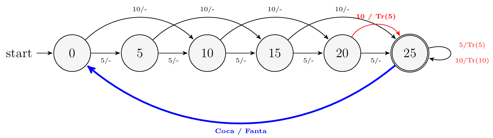
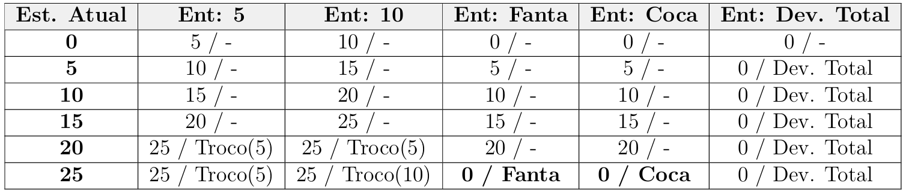

# SodaFountainMachine
This repository contains the VHDL implementation of a finite state machine (FSM) designed to control a soda vending machine. The project was developed for the Practical Digital Systems (SSC-108) course at the Institute of Mathematical and Computer Sciences (ICMC), University of São Paulo (USP).

## System Architecture

The system is modeled as a Mealy Machine. This architecture was chosen because the system's outputs depend on both the current state and the immediate inputs. This design allows for a faster system response time and a reduction in the total number of required states when compared to a Moore Machine.

## Project Objectives

* **State Modeling:** Define a state diagram that accurately represents the accumulation of coins until the product's target price is reached.

* **Mealy Logic Definition:** Establish transition and output conditions where the dispensing of the soda and any necessary change occurs during the state transition.

* **Hardware Description:** Translate the logical state diagram into functional VHDL code.

* **Validation:** Verify the machine's behavior through simulations, ensuring that products are only dispensed when the exact value is reached and that the system properly resets to its initial state.

## State Logic and Transitions

The control system accumulates credit up to a final price of 25 units. The machine processes coin inputs of 5 and 10, alongside product selection inputs ("Fanta" and "Coca-Cola") and a total refund request.

The system operates across six distinct states, which represent the current credit balance: 0, 5, 10, 15, 20, and 25.

* **Credit Accumulation:** During transitions between states 0 and 15, the output remains null as the system is strictly accumulating credit.

* **Change Generation:** If an inserted coin exceeds the target price, the machine calculates and generates change. For example, inserting a 10 input while in state 20 will output 5 in change and advance the system to state 25.

* **Product Dispensing:** Upon reaching state 25, the system waits for a product selection. Once "Fanta" or "Coca-Cola" is selected, the respective product is dispensed, and the machine immediately returns to state 0.

* **Total Refund:** At any state, triggering the "Devolução Total" input transitions the machine back to state 0 while outputting the exact accumulated value.

## Technical Implementation

* **Language:** VHDL.

* **Design and Simulation Software:** Intel Quartus II.

* **Code Structure:** The VHDL implementation utilizes a standard two-process methodology: one synchronous process responsible for updating the current state, and one combinational process dedicated to calculating the next-state logic and the respective outputs. Because of the Mealy architecture, the soda output is triggered in the exact same clock cycle that the purchase condition is satisfied, avoiding the latency of an additional cycle.

## Authors

* Enzo Trulenque Evangelista 

* Luiz Felipe Manzoli Franceschini 

* Pablo Henrique Almeida Vieira 
